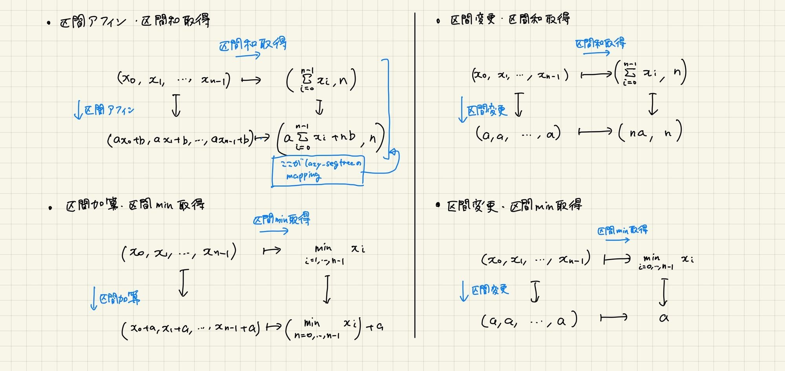

# セグ木のイメージ
出典：https://x.com/paruma184/status/1770787891456675883

# 等差数列とかを載せる場合
https://atcoder.jp/contests/abc353/tasks/abc353_g

https://atcoder.jp/contests/abc371/tasks/abc371_f

X[i]-iを載せると、同じ初項の要素が同じ値になるので管理しやすい